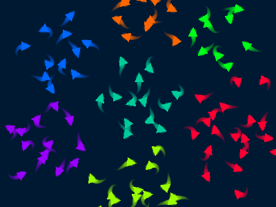
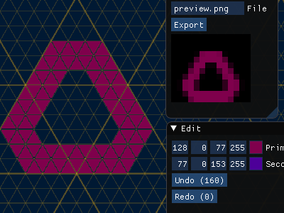
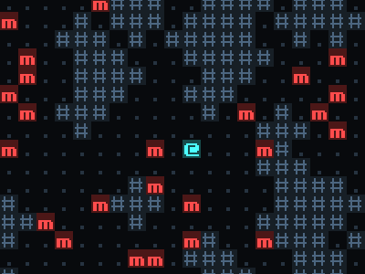

# Samples

## Toolkit

[[Code](Garnet.Toolkit)]

Shared code used by samples, including sprite drawing, particles, noise, audio playback, and more. Depends on [Veldrid](https://veldrid.dev/) for graphics and [OpenTK.OpenAL](https://opentk.net/) for audio.

## Flocking

[[Code](Garnet.Samples.Flocking)]

Boids-style flocking and clustering using Garnet ECS and Veldrid.

## Trixel

[[Code](Garnet.Samples.Trixel)]

Trixel editor using Veldrid and Dear ImGUI.

## Roguelike

[[Code](Garnet.Samples.Roguelike)]

Classic roguelike using Veldrid. Core logic and types are idiomatic F# with no ECS. FSI script allows for replay and testing.

